# MOBILE PROGRAMMING - HAND WRITTEN NOTES
---------------------------------------------
## WEEK 1 - INTRODUCTION
- Mobile development - process of designing, building, and maintaining software that runs on mobile devices

- Mobile apps execute on resource constrained platforms, unlike computers and laptops

- Android is a layered software stack built on top of the Linux kernel

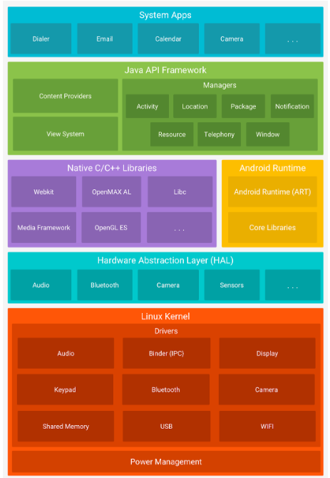

- Linux kernel - foundation of everything, responsibe for low level concerns such as process scheduling, memory management, hardware devices, drivers and so on

- Hardware abstraction layer (HAL) - set of interfaces that allow higher android frameworks to communicate with device specific hardware implementations (camera, bluetooth)

- Android runtime libaries - runtime environment in which apps exectute, typically from dex bytecode 

- Native c/cpp libraries - performance critical system components and libaries that underpin many capabilities and are exposed to apps

- Java API framework - main set of developer facing APIs and system services used to build apps

- System apps - core apps shipped with the device

- Activities / screens - user facing screens that structure navigation and interaction

- Resources - no code assets such as UI strings, images, and config values

- Manifest - a config file that declares the app's key components and capabilities to the system 

- The system decides when UI containers are made, not the actual code

- Activity - a single screen level container made by the android os. Provies window where ui is drawn and acts as a coordination point for navigation, permissions, and system interactions

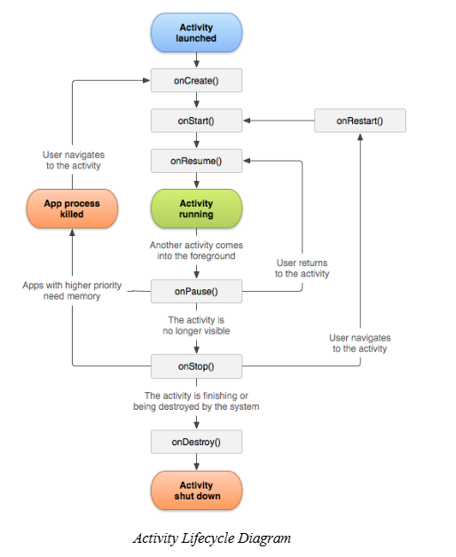

- onCreate() - activity instance is being created
- onStart() - activity becomes visible
- onResume() - activity is in the foreground
- onPause() - activity is losing focus, but might still be partially visible
- onStop() - no longer visible
- onDestroy() - an activity is finishing or being removed
- onRestart() - returning after being stopped

- Module - a project is organized into modules, where each module represents a discrete unit of functionality with its own resources and settings

- Srouce sets - grouping code and resources by purpose 

- Configuration - every android project has this one, defins how the project is built

- Gradle - build automation tool used by Android Studio, essential for compiling code, packaging resources, producing APK / AAB outputs, running tests and preparing release builds

- Gradle handles:
1) dependency management
2) build tasks (compiling, packaging, testing, cleaning previous outputs)
3) build variants (debug, release)

- Root gradle build - for all configs used across the project
- Moduel level gradle - defines module settings, SDK levels, build types and dependencies

- Dependency - external library that your app uses

- libs.versions.toml - used for storing plugin versions

- AVD (android virtual device) - software based android device running on your computer 
- You still gotta test on an actual device tho 

- Debugging - finding failures in software 
- Reproduce, isolate, explain, fix, verify 

- Compile time errors - compilers catches before the app runs (typos, syntax errors)
- Runtime errors - app compiles, but fails to run (nullptrexception, or some other type of exception is thrown)

- Use breakpoints to debug

- Use logcat to view logs for more info:
1) verbose (v) - very detailed high volume tracing
2) debug (d) - more for developers
3) info (i) - used for imortant events (user signed in, sync failed)
4) warn (w) - something unexpected happened, but the code still runs (deprecated package)
5) error (e) - a failure that prevented something from working correctly

- DO NOT LOG SENSITIVE DATA (obviously)

- Stakc trace - printed into logcat after an event happens, tells you what went wrong and where

- Call stack - list of methods and functions that were active when something happened 

- Step operations - when adding a breakpoint during debugging:
1) step over - runs the current line and movees to the next without entering any function, used when you trust the function
2) step into - if the current line calls a function, this takes you inside that function
3) step out - finishes running the entire function and returns to the line after the call in the function that called it earlier

- Profiling - very imporant, measures what your app is doing while it runs, so you can find where time and resources are being spent 

- Jank - stuttering or uneven scrolling / animations, ui looks choppy
- Freeze / hangs - the app stops responding for a moment
- Excessive memory use - the app feels slower over time 

-------------------------------------------------------------------------

## WEEK 2 - KOTLIN FUNDAMENTALS
- Imperative UI programming - everything was defined using XML files, and it was connected to kotlin or java code so that ui could be manipulated
- Declarative UI programming - instead of manually messing with the ui elements, we jut decribe how the interface should look like 

- Composable function - a function annotated with `@Composable`, and informs the screen the element contributes to the ui hierarchy 
- You can combine composables, have them receive data, call other composables etc.

- `setContent` is a function that establishes the entry point of the compose ui hierarchy

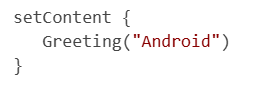

- `@Preview` - visualizing composable functoins without launching an emulator 
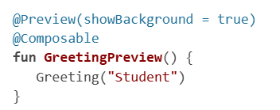

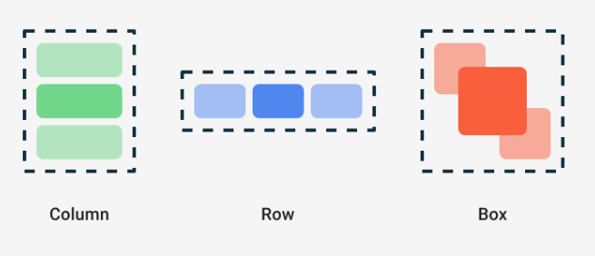
- Column stacks elements on top of each other (and you can control how they look)
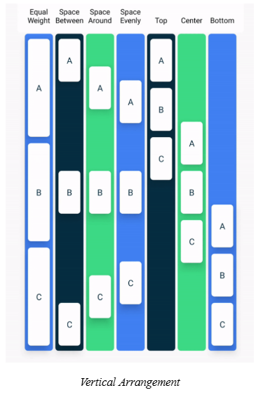

- Row stacks elements next to each other
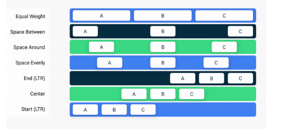

- Box stacks elements in a way they can overlap

- Modifier - collection of instructions that change how a composable behaves or is rendered
- So we are modifiying ui without touching composable's internal logic 
- Modifiers can control:
1) layout properties - size, padding, position
2) visual appearance 
3) interaction behaviour
4) alignment and spacing
5) drawing and clipping effects
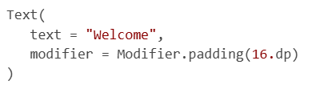

- MODIFIER ORDER MATTERS!!!!

- Other used ui elements in compose are:
1) text
2) image
3) icon
4) spacer
5) surface and card 

- also you should always break things down, do not push eveyrthing into a single file
- make the components reusable

-------------------------------------------------------------------------

# WEEK 3 - COMPONENTS (BUTTONS, IMAGES, MENUS...)
- Buttons - essential for event driven programming
- System waits for a tap or a click
- When the event occurs, a callback function is called and executed
- This is attached through the `onClick`
```
Button(onClick = { /* action */ }) {
   Text("Click me")
}
```

- Default button - most important actions, such as save, submit or confirm
```
Button(
   onClick = { /* save data */ }
) {
   Text("Save")
}
```

- Text button - lighter than the default button, used for secondary actions such as skip, dismiss or learn more
```
TextButton(
   onClick = { /* dismiss dialog */ }
) {
   Text("Dismiss")
}
```

- Outlined button - used for secondary actions that are important but should not visually compete with the primary button, like cancel, edit or go back 
```OutlinedButton(
   onClick = { /* cancel action */ }
) {
   Text("Cancel")
}

```

- Elevated button - kinda elevated from the background, similar to normal button but adds depth and can be used when a desiner wishes to draw a stronger attention to a specific action 
```
ElevatedButton(
   onClick = { /* continue process */ }
) {
   Text("Continue")
}
```

- Icon button - for compact actions, delete, favorite, search or settings
```
IconButton(
   onClick = { /* delete item */ }
) {
   Icon(
       imageVector = Icons.Default.Delete,
       contentDescription = "Delete"
   )
}
```

- Floating action button - used to highlight actions, such as add, create or compose
```
FloatingActionButton(
   onClick = { /* add new item */ }
) {
   Icon(
       imageVector = Icons.Default.Add,
       contentDescription = "Add"
   )
}
```


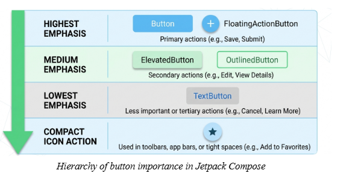


- Buttons are stateless in sense that they do not deal with business logic, but they emit events 

- Stateless composable: receives values and callbacks from parent
- Stateful composable: owsn and manages some parts of the ui state

- Text input is usually controlled by state


- Text field is the standard input field 
```
TextField(
   value = email,
   onValueChange = { email = it },
   label = { Text("Email") },
   placeholder = { Text("Enter your email") }
)
```

- Outlined text field has the same behaviour but outlined background instead of a filled one 

```OutlinedTextField(
   value = questTitle,
   onValueChange = { questTitle = it },
   label = { Text("Quest Title") },
   modifier = Modifier.fillMaxWidth(),
   singleLine = true
)
```

- Label - assocaited with a filed
- Placeholder - appears when there is no text inside of the field 

- Password input and visual transformation
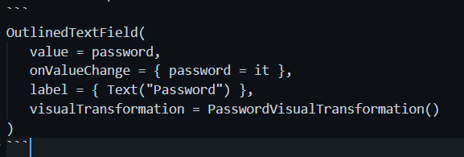


- State hoisting - instead of keepin the state hidden inside one of the composables, it is recomendded to move the state upward to a parent 
- The child receives:
1) current value
2) callback to update the value


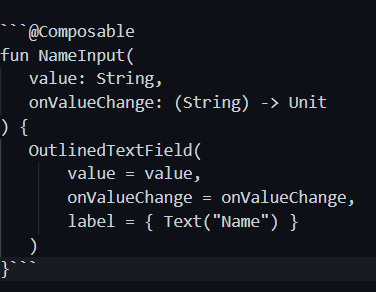


- Selection components include:
1) checkbox - multiple selection
2) radio buttons - single selection
3) radio button group 
4) switch - binary toggle
5) slider - range selection 


- Dealing with images:
1) crop - gotta make things look polished
2) fit - when the whole image must remain visible
3) fillbounds - when exact container filling matters more than proportions
4) inside - when avoiding enlargement is important 

- Aspect ratio - helps to make sure an image maintians a specific ration during layout

- Scaling: how the image is drawn inside the space
- Clipping: the shape of the visible region 

- Icon composables:
1) trash 
2) plus
3) heart
4) arrow
5) menu

Menus:
1) dropdown menu
2) topapp bar 
3) bottomapp bar

Dialogs: 
1) confrim dialog
2) custom dialog
3) alert dialog 

Action icons:
1) search
2) sort
3) delete
4) settings
5) favorite
6) menu expansion

--------------------------------------------------------------------

# WEEK 4 - UNDERSTANDING STATE IN COMPOSE
- 