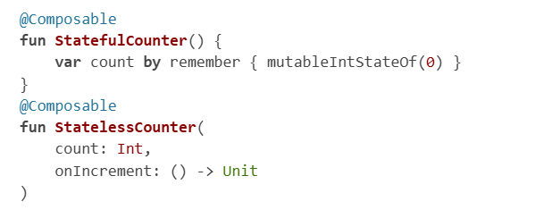
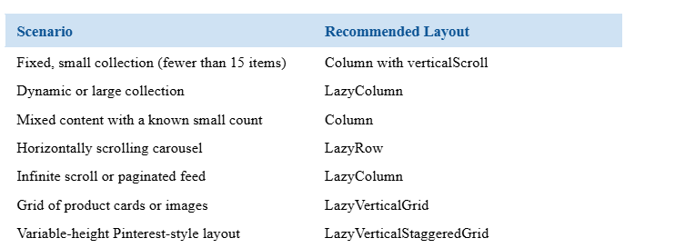
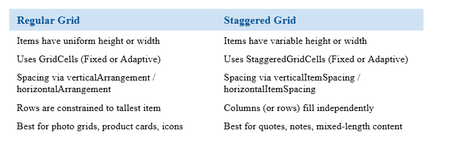
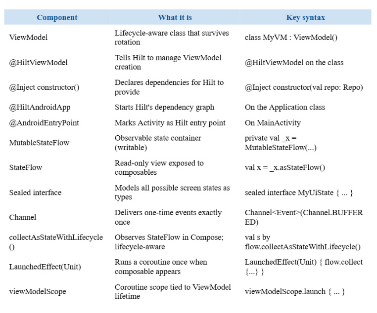
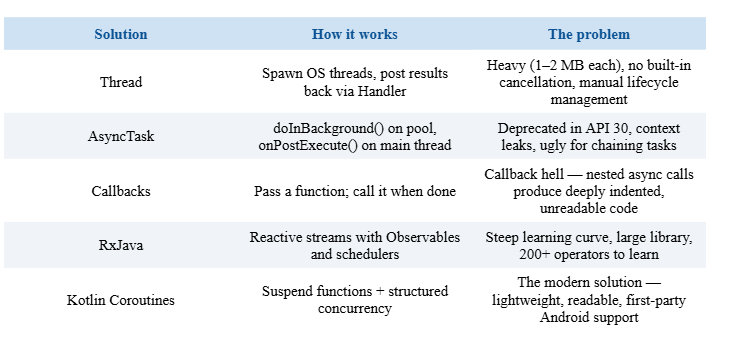
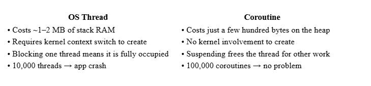
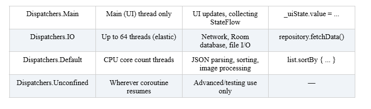

# MOBILE PROGRAMMING - HAND WRITTEN NOTES
---------------------------------------------
## WEEK 2 - INTRODUCTION
- Mobile development - process of designing, building, and maintaining software that runs on mobile devices

- Mobile apps execute on resource constrained platforms, unlike computers and laptops

- Android is a layered software stack built on top of the Linux kernel


- Linux kernel - foundation of everything, responsibe for low level concerns such as process scheduling, memory management, hardware devices, drivers and so on

- Hardware abstraction layer (HAL) - set of interfaces that allow higher android frameworks to communicate with device specific hardware implementations (camera, bluetooth)

- Android runtime libaries - runtime environment in which apps exectute, typically from dex bytecode 

- Native c/cpp libraries - performance critical system components and libaries that underpin many capabilities and are exposed to apps

- Java API framework - main set of developer facing APIs and system services used to build apps

- System apps - core apps shipped with the device

- Activities / screens - user facing screens that structure navigation and interaction

- Resources - no code assets such as UI strings, images, and config values

- Manifest - a config file that declares the app's key components and capabilities to the system 

- The system decides when UI containers are made, not the actual code

- Activity - a single screen level container made by the android os. Provies window where ui is drawn and acts as a coordination point for navigation, permissions, and system interactions


- onCreate() - activity instance is being created
- onStart() - activity becomes visible
- onResume() - activity is in the foreground
- onPause() - activity is losing focus, but might still be partially visible
- onStop() - no longer visible
- onDestroy() - an activity is finishing or being removed
- onRestart() - returning after being stopped

- Module - a project is organized into modules, where each module represents a discrete unit of functionality with its own resources and settings

- Srouce sets - grouping code and resources by purpose 

- Configuration - every android project has this one, defins how the project is built

- Gradle - build automation tool used by Android Studio, essential for compiling code, packaging resources, producing APK / AAB outputs, running tests and preparing release builds

- Gradle handles:
1) dependency management
2) build tasks (compiling, packaging, testing, cleaning previous outputs)
3) build variants (debug, release)

- Root gradle build - for all configs used across the project
- Moduel level gradle - defines module settings, SDK levels, build types and dependencies

- Dependency - external library that your app uses

- libs.versions.toml - used for storing plugin versions

- AVD (android virtual device) - software based android device running on your computer 
- You still gotta test on an actual device tho 

- Debugging - finding failures in software 
- Reproduce, isolate, explain, fix, verify 

- Compile time errors - compilers catches before the app runs (typos, syntax errors)
- Runtime errors - app compiles, but fails to run (nullptrexception, or some other type of exception is thrown)

- Use breakpoints to debug

- Use logcat to view logs for more info:
1) verbose (v) - very detailed high volume tracing
2) debug (d) - more for developers
3) info (i) - used for imortant events (user signed in, sync failed)
4) warn (w) - something unexpected happened, but the code still runs (deprecated package)
5) error (e) - a failure that prevented something from working correctly

- DO NOT LOG SENSITIVE DATA (obviously)

- Stakc trace - printed into logcat after an event happens, tells you what went wrong and where

- Call stack - list of methods and functions that were active when something happened 

- Step operations - when adding a breakpoint during debugging:
1) step over - runs the current line and movees to the next without entering any function, used when you trust the function
2) step into - if the current line calls a function, this takes you inside that function
3) step out - finishes running the entire function and returns to the line after the call in the function that called it earlier

- Profiling - very imporant, measures what your app is doing while it runs, so you can find where time and resources are being spent 

- Jank - stuttering or uneven scrolling / animations, ui looks choppy
- Freeze / hangs - the app stops responding for a moment
- Excessive memory use - the app feels slower over time 

-------------------------------------------------------------------------

## WEEK 3 - KOTLIN FUNDAMENTALS
- Imperative UI programming - everything was defined using XML files, and it was connected to kotlin or java code so that ui could be manipulated
- Declarative UI programming - instead of manually messing with the ui elements, we jut decribe how the interface should look like 

- Composable function - a function annotated with `@Composable`, and informs the screen the element contributes to the ui hierarchy 
- You can combine composables, have them receive data, call other composables etc.

- `setContent` is a function that establishes the entry point of the compose ui hierarchy


- `@Preview` - visualizing composable functoins without launching an emulator 


- Column stacks elements on top of each other (and you can control how they look)


- Row stacks elements next to each other


- Box stacks elements in a way they can overlap

- Modifier - collection of instructions that change how a composable behaves or is rendered
- So we are modifiying ui without touching composable's internal logic 
- Modifiers can control:
1) layout properties - size, padding, position
2) visual appearance 
3) interaction behaviour
4) alignment and spacing
5) drawing and clipping effects


- MODIFIER ORDER MATTERS!!!!

- Other used ui elements in compose are:
1) text
2) image
3) icon
4) spacer
5) surface and card 

- also you should always break things down, do not push eveyrthing into a single file
- make the components reusable

-------------------------------------------------------------------------

# WEEK 4 - COMPONENTS (BUTTONS, IMAGES, MENUS...)
- Buttons - essential for event driven programming
- System waits for a tap or a click
- When the event occurs, a callback function is called and executed
- This is attached through the `onClick`
```
Button(onClick = { /* action */ }) {
   Text("Click me")
}
```

- Default button - most important actions, such as save, submit or confirm
```
Button(
   onClick = { /* save data */ }
) {
   Text("Save")
}
```

- Text button - lighter than the default button, used for secondary actions such as skip, dismiss or learn more
```
TextButton(
   onClick = { /* dismiss dialog */ }
) {
   Text("Dismiss")
}
```

- Outlined button - used for secondary actions that are important but should not visually compete with the primary button, like cancel, edit or go back 
```OutlinedButton(
   onClick = { /* cancel action */ }
) {
   Text("Cancel")
}

```

- Elevated button - kinda elevated from the background, similar to normal button but adds depth and can be used when a desiner wishes to draw a stronger attention to a specific action 
```
ElevatedButton(
   onClick = { /* continue process */ }
) {
   Text("Continue")
}
```

- Icon button - for compact actions, delete, favorite, search or settings
```
IconButton(
   onClick = { /* delete item */ }
) {
   Icon(
       imageVector = Icons.Default.Delete,
       contentDescription = "Delete"
   )
}
```

- Floating action button - used to highlight actions, such as add, create or compose
```
FloatingActionButton(
   onClick = { /* add new item */ }
) {
   Icon(
       imageVector = Icons.Default.Add,
       contentDescription = "Add"
   )
}
```


- Buttons are stateless in sense that they do not deal with business logic, but they emit events 

- Stateless composable: receives values and callbacks from parent
- Stateful composable: owsn and manages some parts of the ui state

- Text input is usually controlled by state


- Text field is the standard input field 
```
TextField(
   value = email,
   onValueChange = { email = it },
   label = { Text("Email") },
   placeholder = { Text("Enter your email") }
)
```

- Outlined text field has the same behaviour but outlined background instead of a filled one 

```OutlinedTextField(
   value = questTitle,
   onValueChange = { questTitle = it },
   label = { Text("Quest Title") },
   modifier = Modifier.fillMaxWidth(),
   singleLine = true
)
```

- Label - assocaited with a filed
- Placeholder - appears when there is no text inside of the field 

- Password input and visual transformation


- State hoisting - instead of keepin the state hidden inside one of the composables, it is recomendded to move the state upward to a parent 
- The child receives:
1) current value
2) callback to update the value


- Selection components include:
1) checkbox - multiple selection
2) radio buttons - single selection
3) radio button group 
4) switch - binary toggle
5) slider - range selection 


- Dealing with images:
1) crop - gotta make things look polished
2) fit - when the whole image must remain visible
3) fillbounds - when exact container filling matters more than proportions
4) inside - when avoiding enlargement is important 

- Aspect ratio - helps to make sure an image maintians a specific ration during layout

- Scaling: how the image is drawn inside the space
- Clipping: the shape of the visible region 

- Icon composables:
1) trash 
2) plus
3) heart
4) arrow
5) menu

Menus:
1) dropdown menu
2) topapp bar 
3) bottomapp bar

Dialogs: 
1) confrim dialog
2) custom dialog
3) alert dialog 

Action icons:
1) search
2) sort
3) delete
4) settings
5) favorite
6) menu expansion

--------------------------------------------------------------------

# WEEK 5 - UNDERSTANDING STATE IN COMPOSE
- State - any value that can chanfe and affect what the user sees on the screen
- Can be text entered into a field, whether a checkbox is checked, tab is selected, password is visible, you get the gist

- The UI should reflect the current state
- The developer updates the state, and compose deals with the UI

- Composition: when a compose screen is shown for the first time, compose runs the composable functions and builds the UI
- Recomposition: later when a state changes, compose runs the affected composable again and updates the ui
- Smart recomposition: updating only the affected parts, also known as selective recomposition

## mutableStateOf()
- creates a state value that compose can track, when the value changes it knows it needs an update
- so the whole point is to make a value observable by compose

## remember
- keeps a value in memory while the composable stays in composition
- without it, the value we created in a composable would be recreated every single time 

## rememberSaveable
- sometimes keeping the state during recomposition does not cut it
- the screen may be recreated sometimes because of config changes, such as device rotation
- works like `remember`, but it also tries to restore the value after the change happens 

## delegate state syntax - by keyword
- when working with state, you will often see `by` keyword
- used to make state code easier to read
- without it, we access stuff via .value()
- with it, the syntax becomes cleaner

## Derived State
- when a value can be calculated from other state values 
- keeps ui clean

## derivedStateOf
- we use that for derived state

## stateful composable
- keeps and updates its own state inside itself

## stateless composable
- does not keep the state, receives it through parameters, sends user actions back through callbacks.



## state hoisting
- moving state from child composable to parent composable
- child does not handle anything
- it only receives the value it should display, and when user interacts with it it uses callbacks to communicate

## SSOT single source of truth
- one piece of important state should be in one place only
- this is useful because if we were to store a same logical value in multiple places, we might create incosistencies across UI

## IMPORTANT - DATA GOES DOWN, EVENT GOES UP / UNIDIRECTIONAL DATA FLOW
- what we explained earlier
- data goes down from parent to child
- event goes from child to parent 

## important note
- even though we can use state hoisting, does not mean we should all the time
- if it's something really small, it really is not necessary

## MANAGING DIFFERENT KINDS OF STATE 
- not all state plays the same role
- that is why we need some sort of classification
- types:
1) form state - login, register...
2) collection state - list of tasks, notes, contacts
3) temporary ui state - add item, remove, favourite, like
4) selection and control state - password visibility, toggle sometihng


-------------------------------------------------------------------------

# WEEK 6 - SCROLLABLE LISTS
- Why does it matter? - every mobile app contains a list of some kind
- the important thing is how an app renders everything 
- before xml was used
- now, the dev says what needs to be displayed on the screen and composable handles the rendering 

## UNDERSTANDING HOW IT WORKS
- Imagine we are using a lazy layout. We have a list that consists of 50 elements. The user has only seen 3 so far on the screen, but all 50 are already loaded. 
- This is fine when the number of items is small, but when we are dealing with something on a larger scale it is far from ideal. 

## LAZY LAYOUTS AND THE WAY THEY COMPOSE
- Lazy layouts solve this by composing only the items that are visible on the screen, plus a small buffer of items just outside the visible area



# LAZY DSL LAYOUT BUILDERS
- Inside a lazy component block, children are delcared using dsl methods:
1) item { } - emits a single item
2) items(list) { } - loops over a list 
3) itemsIndexed(list) { } - loops over a list, providing both item and its index

# PRESERVING STATE VIA ITEMS
- By default compose uses an items position index as its unique id
- deleting or reordering items can cause data loss

# LAZY LIST STATE
- Monitors and controls real time scroll position of a lazy container
- Allows for live data reading whether the user is actively scrolling or not

# LAZY VERTICAL GRID
- collection of items in a multi colum format that scrolls down vertically, wraps from left to right onto the next row
- good for structured feeds like photo galleries

# PROGRAMMATIC SCROLLING
- ability to move the lists scroll position via code rather than requiring manual user touch input
- uses coroutines / async suspend functions `scrollToItem`

# GRIDCELLS OPTIONS
- determines exactly how columns or rows are calculated and distributed

# LAZY HORIZONTAL GRID
- Fills from top to bottom first

# LAZY VERTICAL / HORIZONTAL STAGGERED GRID
- allows different dimensions for each grid, something like a pinterest board





------------------------------------------------------------------------

# WEEK 7 - NAVIGATION AND INTENTS
# HOW IT USED TO WORK
- fragmentmanager was used before

# WHAT NAVIGATION SOLVES
- provides a single map of your entire application flow while automatically managing the back stack when a user hits the back button
- type safe argument parsing between screens
- prevents runtime crashes

# NAVCONTROLLER
- brain of the architecture
- tracks the users history, manages backstack, coordinates display switches
- must be instantiated at the root of ui tree using `rememberNavController`
- must be passed downard, because we want a simple consistent pipeline

# NAVHOST
- placeholder that swaps screen composables in and out depending where the user navigates
- requires `NavController` instance to listen for changes
- also needs `startDestination`

# NAVGRAPH DESTINATIONS
- contains every single endpoint withinn the app
- declared in navhost builder block
- a destination is an individual composable screen tied to a route string that acts as its identifier on the map

# COMPOSABLE() FUNCTION
- builder method
- used inside navhost to register scrreen desintation into the entire map
- lambda block with navbakcstackentry
- allows extraction of cinoming arguments from the route string to securely scope a local viewmodel tothat screens lifecycle

# ROUTES AS STRINGS
- routes use string paths for simple windows and bracketed pplaceholder notation to signal that an essential piece of text data must be embedded within the path during transitions

# GOING BACK: NAVIGATEUP() AND POPBACKSTACK()
- `popBackStack` drops the top screen and fails if the stack is empty
- `MapsUp` is intelligent, context aware and can exit to a parent app if no internal screens remain

# OBSERVING CURRENT DESINTATION
- `navController.currentBackStackEntryAsState()` real time observer for persistent screen

# REQUIRED ARGUMENTS
- mandatory requirements within a route string
- like path variables inside a link

# NAVTYPE
- tells the nav system how to interpret raw route path texxt into a strict kotlin primitive type (we have string, int and bool)

# OPTIONAL ARGUMENTS
- use query string formatting, and must declare an explicit default fallback value

# MULTIPLE ARGUMENTS IN ONE ROUTE
- you can have several arguments in one route by appending placeholders sequentially along the string path

# PASSING COMPLEX DATA
- do not pass complex data, use a lightweight unique id or integer
- the screen should only accept that id and handle data retrieval directly from viewmodel

-------------------------------------------------------------------------

# WEEK 8 - VIEWMODEL AND STATE MANAGEMENT IN COMPOSE
# WHY?
- Android treats screen rotation as a configuration change
- So it destroys the current activity and makes a new one (oncreate + ondestroy)
- rememberSaveable is not enough either, because it has some limitations:
1) size limit of 1 MB, so a list of objects would be far too large
2) type restriction - only primitives
3) process death - if OS kills your process, nothing can save it
4) no business logic - state that depends on repository calls, validation or computation belongs somewhere that can hold logic, not jut data 

# WHAT IS A VIEWMODEL
- viewmodel stores and manages ui related data in a life cycle conscious way
- it is not attached to activity instance
- it is stored in a separate structure called the `ViewModelStore`

# REQUESTING A VIEW MODEL
- do not call its constructor ridrectly
- that makes a plain object with no lifecycle awareness
- you request it through a framework, which either gets the existing instance or makes a new one 

```
@Composable
fun CounterScreen(viewModel: CounterViewModel = viewModel()) {
    // viewModel() returns the existing instance after rotation
    // It never creates a second one if one already exists
}
```

# VIEWMODEL LIFETIME
- Survives as long as its associated screen is on the backstack 

# WHAT BELONGS TO THE VIEWMODEL?
- Business state
- Anything UI related belongs to the screens 

# MVVM
- Model -> View -> ViewModel 
- separates an application in three different layers
- Data flow - `model -> viewmodel -> view`
- User interaction; `view -> viewmodel -> model`

# MODEL
- responsible for all the data
- how to fetch, store, everything
- repositories, room database, retrofit api, datastore
- has no knowledge of ui whatsoever

# VIEWMODEL
- coordinator
- requests data from model
- applies business logic such as filtering or validation
- exposes the result as an observable state
- again, holds no connection to the UI

# VIEW
- our composables
- only job is to read state from the viewmodel and display it
- when the user interacts with the screen, the composable calls a function on the viewmodel
- it never modifies data directly and never talks to the model layer 

# DEPENDENCY
- any object that a class needs to work with
- a class declares what it needs on the constructor 
- then, the di framework is responsible for creating and providing those dependencies 

# HILT
- dependency injection frameowrk built on top of dagger
- reads annotations above classes and generates all the code automatically
- you do not need to write anything yourself, just delcare what you need

# FOUR HILT ANNOTATIONS 
- `@HiltAndroidApp`- goes on the custom application class. starting point for hilt, and it tells dependency graph where the application starts before any activity or screen is loaded
- `@AndroidEntryPoint` - goes on any component that will host composables that use hilt provided viewmodels. so tells the hilt that the activity is a place where injected objects can be requested.
- `@Inject` - you are telling hilt that when something asks for this type, use this constructor to build an instance. this is how a repo or any other class becomes injectable, hilt knows how to create it. 
- `@HiltViewModel`- this combined with inject on the viewmodel tells hilt to manage the viewmodels creation and injection. hilt reads the viewmodel, sees what dependencies are needed and finds the corresponding inject annotation on those and generates code. 

# STATE FLOW
- plain variables cannot be observed or survive rotation
- state flow holds a single valye and notifies all observers on value change
- characteristics:
1) always holds a value
2) hot, it exists and runs whether someone is watching it or not
3) only emits on change
4) thread safe 
- the convention is to have two declarations for every piece of state, private and public 

```
class CounterViewModel : ViewModel() {

    // Private -- only CounterViewModel can change this
    private val _count = MutableStateFlow(0)

    // Public -- composables observe this, but cannot write to it
    val count: StateFlow<Int> = _count.asStateFlow()

    fun increment() {
        _count.value = _count.value + 1   // Only ViewModel writes here
    }
}
```

# COLLECTING STATE FLOW
- `collectAsStateWithLifecycle`
- `collectAsState`
- the first one is preffered because it pauses collection when the app goes to the background 
- saves battery and prevents unnecessary work 

# SEALED INTERFACE
- you declare all possible subtypes in a single file
- the compiler knows every subtype that exists 

# DATA OBJECT VS DATA CLASS
- when a state has no data to carry, we use `data object`
- its a singleton, and there is only instance of it in the memory, good for loading or init that carry no payload
- when a state needs to hold data, use `data class`

# RENDERING STATE WITH WHEN EXPRESSION 
```
when (uiState) {
    is LoginUiState.Loading -> {
        // Show a loading spinner
        CircularProgressIndicator()
    }
    is LoginUiState.Error -> {
        // Show the error message
        Text(text = (uiState as LoginUiState.Error).message)
    }
    is LoginUiState.Success -> {
        // Show success content
    }
    is LoginUiState.Init -> {
        // Show the default form
    }
}
```

# WHY COROUTINES ON VIEWMODEL
- everything that happens, loading data, validation, writing to database cannot happen on main thread
- the app freezes
- it is better to do that in an async way without blocking anything

# WHAT IS VIEWMODELSCOPE 
- every viewmodel has a viewmodel scope - coroutine scope
- it is tied to its lifetime
- cancelled when viewmodel is ceared
- prevents memory leaks and makes sure no background outlives a screen

# CHANNEL 
- use it to deliver an event exactly once to a single collector and does not replay past events 
- Channel.BUFFERED means events are stored in a buffer and not lost 

# COLLECTING EVENTS
- `LauncedEffect(unit)`

# INIT 
- runs exactly once when its created
- used when screens need data loaded automatically as they appear 




----------------------------------------------------------------------

# WEEK 9 - COROUTINES AND ASYNC PROGRAMMING
- DO NOT USE THE MAIN THREAD FOR EVERYTHING
- Google play uses ANR (application not responding)
- anything above 0.47% is bad 



# COROUTINE
- a unit of work that can suspend itself
- can pause its own execution without blocking the thread its running on
- when the coroutine suspends, the thread it was using becomes free to do other work 
- COROUTINE IS NOT THE SAME THING AS A THREAD
- coroutines can share a small number of threads 



# SUSPEND KEYWORD
- tells modifier a function may pause at some point without blocking the main thread
1) rule 1: suspend function can only be called from another suspend function
2) rule 2: calling a suspend function does not switch threads, that is the job of a dispatcher  

- `launch` - when you want to start a coroutine but you do not need the result. used when the result is handled by state.
- `async` - when you need to start a corotuine that will produce a small result. use `Deffered<T>` a promise of a future value, and you can call `await()` to get the result
- `runBlocking` - for testing purposes only. 

# DISPATCHERS
- determines which thread or thread pool a coroutine runs on
- a corouinte starts on the main thread by default
- for work that has heavy operations, you must switch to a dispatcher
- choosing the wrong dispatcher can happen 



- you can switch dispatchers using `withContext()`

- the thing with context switching is it returns back to the main thread after the work is done 

# FLOW 
- a suspend function can only return one value when it is done
- but in a real world, many valus are emitted over time
- for these cases we have `Flow<T>`
- you can think of this as a suspend function that returns multiple times

# COLD STREAM
- needs to be created
- everything starts from the beginning each time
- for one collector that computation runs once
- for two it runs twice
- api calls, file reads

# HOT STREAM
- already running regardless of collectors
- gets the current state of events
- many collectors share same stream
- no duplicate work
- like live tv, its still there whether you watch it or not 
- ui state, events, viewmodel
- so basically for ui communication 

# FLOP OPERATORS
- `.map`
- `.filter`
- `.take`
- `.onEach`
- `.debounce`
- `.distinctUntilChange`
- `.collect`
- `.toList`
- `.first`
- `.single`
- `.count`
- `.reduce`

# SHARED FLOW
- when you need to send an event to the ui that should be processed exactly once 
- has no current value
- good for navigation, snackbar messages, dialog triggers
